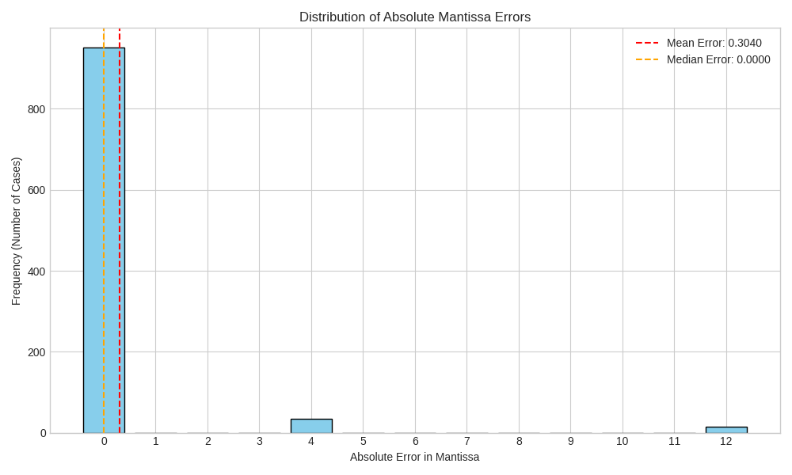
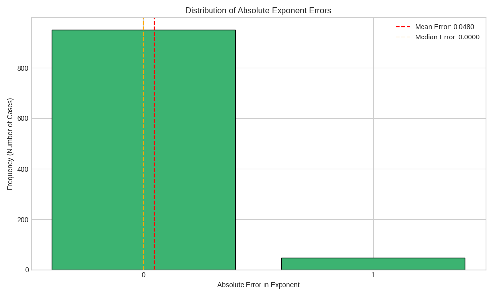
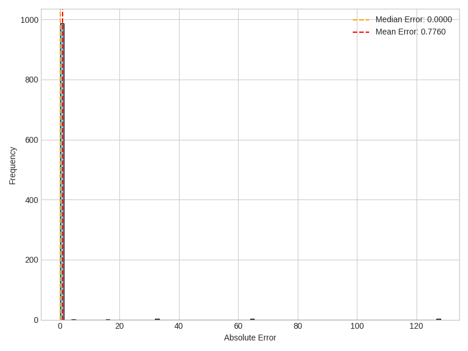

## Synthesis Loop

The **loop.py** script synthesizes hardware logic for MXInt4 multiplication. It iteratively adds input-output examples as constraints and uses the CVC5 solver to find a program that satisfies them. If the solver times out on a new constraint, that constraint is skipped. The final synthesized program is saved for evaluation.

## Evaluation

The file **evaluate.ipynb** compares the SMT-LIB multiplication code generated by SyGus to the ground truth values on randomly generated examples, and displays some metrics.

## Grammars (TODO)


## Constraints (TODO)
 
#### Constraint Seclection

#### Loosening the Constraints

## Results

We have managed to succesfully synthethise a function for the multiplication of 2 MXint4 values. The SMT-LIB code for calculating the mantissa and exponent of the product is below. The statistics/results can be replicated with **evaluate.ipynb**


```lisp
(
(define-fun mult_mxint_mant ((m1 (_ BitVec 4)) (m2 (_ BitVec 4))) (_ BitVec 4)
  (let ((product (bvmul ((_ sign_extend 4) m1) ((_ sign_extend 4) m2))))
    (let ((abs_product (ite (bvslt product #b00000000) (bvneg product) product)))
      (let ((renorm_needed (bvsle abs_product #b00100000)))
        ((_ extract 3 0)
          (ite renorm_needed
               (bvashr (bvshl product #b00000001) #b00000011)
               (bvashr product #b00000011)
          )
        )
      )
    )
  )
)
)
```

#### Mantissa-Level Performance


| Metric | Value |
| :--- | :--- |
| **Total Test Cases** | 1000 |
| **Exact Matches** | 95.20% |
| **Mean Absolute Error** | 0.3040 |
| **Median Absolute Error** | 0.0 |
| **Max Absolute Error** | 12 |




```lisp
(
(define-fun mult_mxint_exp_final ((m1 (_ BitVec 4)) (e1 (_ BitVec 4)) (m2 (_ BitVec 4)) (e2 (_ BitVec 4))) (_ BitVec 4)
  (let ((renorm_flag
          (let ((product (bvmul ((_ sign_extend 4) m1) ((_ sign_extend 4) m2))))
            (let ((abs_product (ite (bvslt product #x00) (bvneg product) product)))
              (ite (bvsle abs_product #x20) #b1 #b0)))))
    (let ((sum_exp (bvadd e1 e2)))
      (ite (= renorm_flag #b1)
           (bvsub sum_exp #b0001)
           sum_exp))))
)
```

#### Exponent-Level Performance

| Metric | Value |
| :--- | :--- |
| **Total Test Cases** | 1000 |
| **Exact Matches** | 95.20% |
| **Mean Absolute Error** | 0.048 |
| **Median Absolute Error** | 0.0 |
| **Max Absolute Error** | 1 |



#### Dequantized Performance

| Metric | Value |
| :--- | :--- |
| **Total Test Cases** | 1000 |
| **Exact Matches** | 98.60% |
| **Mean Absolute Error** | 0.776 |
| **Median Absolute Error** | 0.00 |





## Experiments with genetic programming

Started with addition for some reason, TODO: repeat for multiplication

